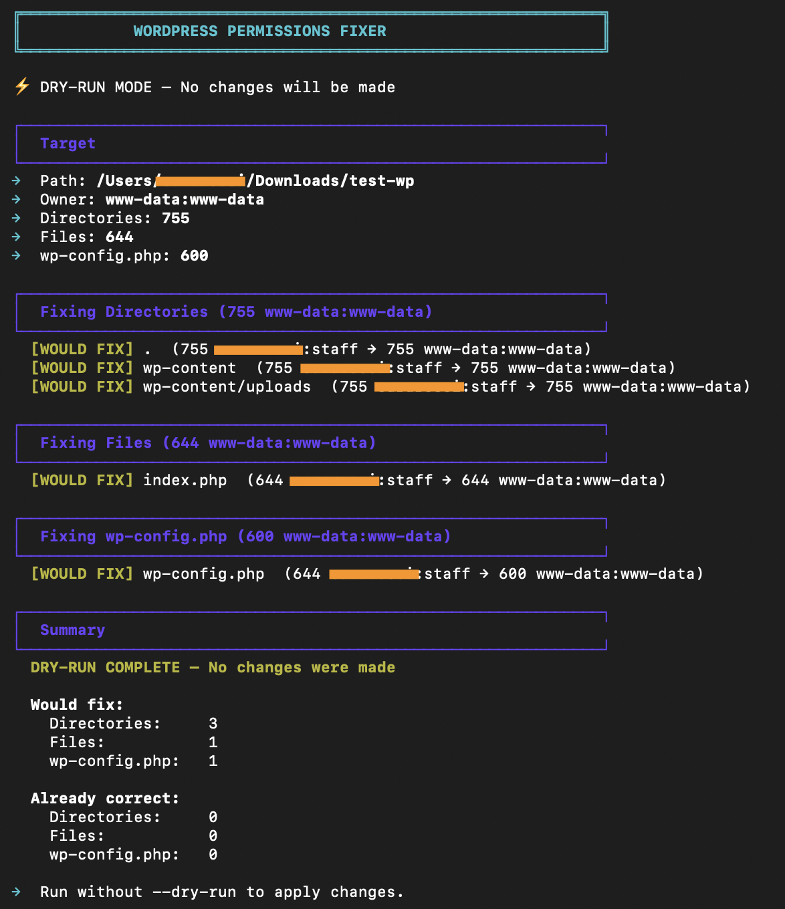

<div align="center">

# 🔒 sec-wp-permissions

**One-command WordPress permission hardening with a safety-first dry-run mode.**


</div>

---

## 📸 Demo



*Dry-run preview showing exactly what would change before you commit.*

---

## 🎯 The Problem

WordPress permissions are a silent security risk. Upload directories left at `777`. `wp-config.php` readable by any user. Files owned by `root` instead of the web server. One misconfigured permission can expose database credentials or allow arbitrary file uploads.

Most fixes online are copy-paste `chmod -R` commands that are **dangerous** — they don't distinguish between directories, files, and config files. One wrong command and your `wp-config.php` is world-readable.

---

## ✅ The Solution

A single Bash script that applies the **WordPress.org recommended permission model** with surgical precision:

| Target | Permission | Owner | Why |
|--------|-----------|-------|-----|
| **All directories** | `755` | `www-data:www-data` | Execute bit required to traverse subdirectories |
| **All files** | `644` | `www-data:www-data` | Readable by web server, not writable by group/others |
| **wp-config.php** | `600` | `www-data:www-data` | **Locked down** — contains DB passwords, salts, API keys |

**Key features:**
- 🛡️ **Dry-run mode** — Preview every change with before → after values. Zero surprises.
- 🧠 **WordPress detection** — Warns if the target path doesn't look like WordPress
- 🎯 **Surgical fixes** — Only touches items that actually need changing; reports skips
- 📊 **Summary report** — Counts fixed vs. already-correct items
- ⚡ **Fast** — Uses `find -print0` for safe handling of filenames with spaces

---

## 🚀 Quick Start

```bash
# 1. Clone the repo
git clone https://github.com/saraita90/sec-wp-permissions.git
cd sec-wp-permissions

# 2. Preview what it would do (ALWAYS run this first)
sudo bash src/fix-wp-permissions.sh /var/www/html --dry-run

# 3. Apply the fixes
sudo bash src/fix-wp-permissions.sh /var/www/html
```

---

## 📁 Project Structure

```
sec-wp-permissions/
├── README.md              # This file
├── src/
│   └── fix-wp-permissions.sh    # Main script
├── docs/
│   └── screenshot.png     # Terminal demo screenshot
└── .gitignore
```

---

## 🔧 Tech Stack

- **Bash 4+** — Scripting engine
- **`find` with `-print0`** — Safe traversal of filenames containing spaces or special characters
- **`stat`** — Reading current permissions and ownership before deciding to act
- **`chown` / `chmod`** — Standard POSIX permission management

---

## 📚 What I Learned

- **The `600` rule for `wp-config.php`** — WordPress.org explicitly recommends locking down the config file because it contains database credentials, authentication salts, and sometimes API keys. A `644` config file means any user on the server can read your passwords.
- **Why `755` for directories, not `644`** — The execute (`x`) bit on a directory controls whether you can list or traverse its contents. Removing it breaks WordPress's ability to read theme/plugin subdirectories.
- **Dry-run as a design pattern** — Building a `--dry-run` flag forced me to separate "detection" from "action." The script must read current state, compare against target state, and report the delta — all before touching a single file. This makes the tool safe for production use.
- **`find -print0` + `read -d ''`** — The only safe way to handle filenames with spaces, newlines, or special characters in Bash. A common `for file in $(find...)` loop will break on real-world WordPress sites (think `wp-content/uploads/2024/01/image name.jpg`).
- **WordPress fingerprinting** — Before acting, the script checks for `wp-config.php`, `wp-config-sample.php`, or `wp-content/` to confirm the target is actually WordPress. This prevents accidentally running the script on `/etc` or `/home`.

---

## 🗺️ Roadmap

- [ ] Add `--owner` flag for non-`www-data` setups (e.g., `nginx`, custom users)
- [ ] Add `--uploads` flag to set `wp-content/uploads` to `775` for shared hosting
- [ ] JSON / CSV export of the dry-run report for audit trails
- [ ] Check for `.htaccess` and ensure it's `644` (some hosts lock it to `444`)

---

## ⚠️ Safety Notes

- **Always run `--dry-run` first** on any new site
- **Requires `sudo`** because changing ownership to `www-data` needs root
- **Does NOT fix SELinux contexts** — if you use SELinux, run `restorecon` separately
- **Tested on Ubuntu/Debian** with `www-data` user. Adjust owner for other distros.

---

<div align="center">

**Built with** 🛡️ **and** 🐧 **Linux**

[⬆ Back to Portfolio](https://github.com/saraita90/sara-rossi)

</div>
